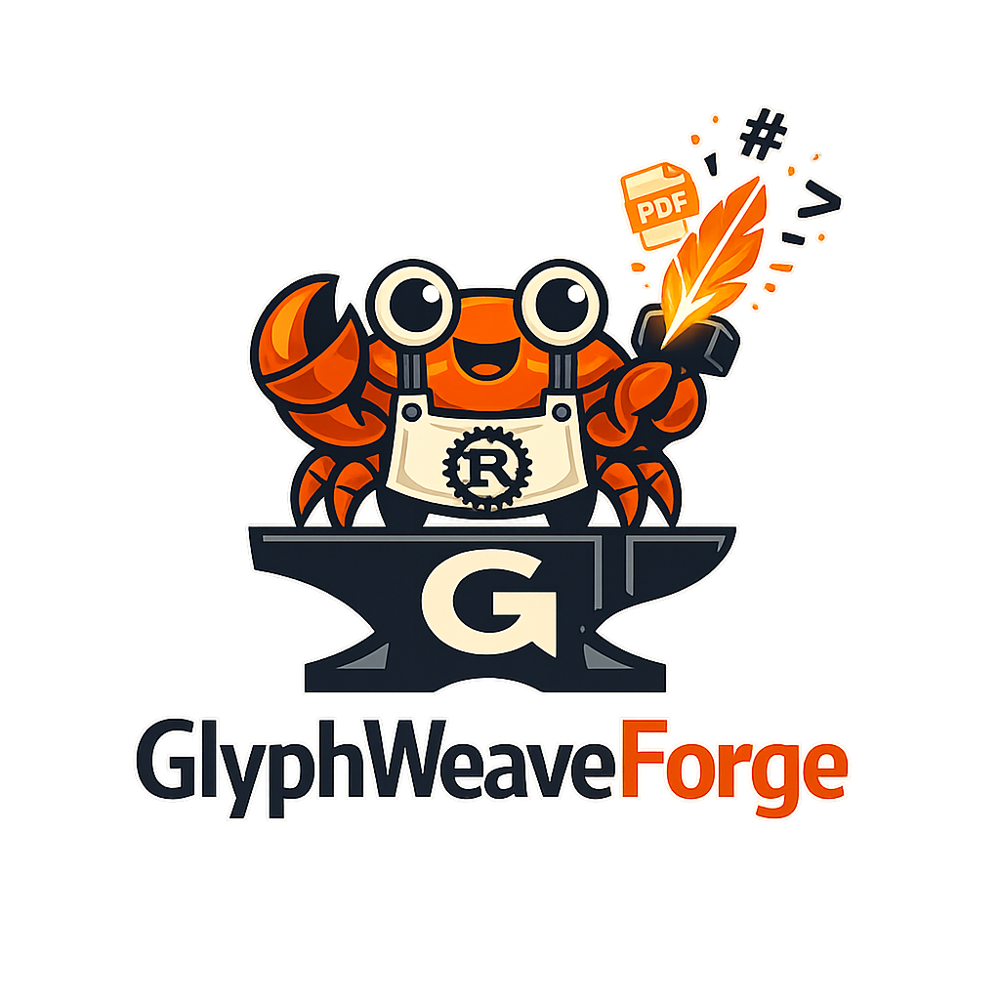

# GlyphWeaveForge

GlyphWeaveForge converts Markdown into PDF through a small Rust pipeline with explicit boundaries:

`api -> pipeline -> core -> adapters`

The crate ships a lightweight built-in renderer by default and can optionally use Typst without changing the public builder API.

## What the crate provides today

- A fluent `Forge` builder for Markdown-to-PDF conversion.
- Three input modes: UTF-8 text, UTF-8 bytes, and filesystem paths (`fs` feature).
- Three output modes: in-memory bytes, explicit file path, and output directory (`fs` feature).
- Built-in page sizes (`A4`, `Letter`, `Legal`, custom millimeter sizes).
- Built-in layout modes (`Paged`, `SinglePage`).
- Built-in themes with optional JSON overrides.
- Resource resolution through filesystem lookup (`fs`) or caller-provided resolvers.
- Renderer extension points through public `RenderBackend` and `ResourceResolver` traits.
- Two backend selections behind a stable builder API: `Minimal` by default and `Typst` when the feature is enabled.

## Installation

```toml
[dependencies]
glyphweaveforge = "0.1.1"
```

Enable optional features when you need them:

```toml
[dependencies]
glyphweaveforge = { version = "0.1.1", features = ["renderer-typst"] }
```

## Main builder flow

```rust
use glyphweaveforge::Forge;

let pdf = Forge::new()
    .from_text("# Hello\n\nWorld")
    .to_memory()
    .convert()
    .expect("conversion should succeed");

let bytes = pdf.bytes.expect("memory output should contain PDF bytes");
assert!(bytes.starts_with(b"%PDF"));
```

`Forge::new()` starts with these defaults:

- source: not set
- output: not set
- backend: `RenderBackendSelection::Minimal`
- page size: `PageSize::A4`
- layout mode: `LayoutMode::Paged`
- theme: `BuiltInTheme::Professional`

## Supported inputs and outputs

Always available:

- `from_text`
- `from_bytes`
- `to_memory`
- injected resource resolvers through `with_resource_resolver` or `with_resource_adapter`
- explicit backend selection through `with_backend`
- custom renderer injection through `with_renderer`
- full option replacement through `with_options`

Available with the default `fs` feature:

- `from_path`
- `to_file`
- `to_directory`
- `with_output_file_name` for directory outputs
- filesystem-based resource lookup for local assets relative to the markdown file

### Output behavior

- `to_memory()` returns `PdfOutput { bytes: Some(...), written_path: None }`.
- `to_file(...)` writes the PDF and returns `PdfOutput { bytes: None, written_path: Some(...) }`.
- `to_directory(...)` creates the directory if needed and derives the file name from the source name unless `with_output_file_name(...)` overrides it.

When deriving a directory output name, the crate appends `.pdf` if it is missing.

## Page sizes, layout modes, and themes

### Page sizes

- `PageSize::A4`
- `PageSize::Letter`
- `PageSize::Legal`
- `PageSize::Custom { width_mm, height_mm }`

Custom page sizes must be strictly positive.

### Layout modes

- `LayoutMode::Paged`: paginates rendered lines across pages.
- `LayoutMode::SinglePage`: keeps the rendered content in a single page payload.

### Built-in themes

- `BuiltInTheme::Invoice`
- `BuiltInTheme::ScientificArticle`
- `BuiltInTheme::Professional` (default)
- `BuiltInTheme::Engineering`
- `BuiltInTheme::Informational`

`with_theme(...)` selects a built-in preset. `with_theme_config(...)` lets you combine an optional built-in theme with JSON overrides such as:

- `name`
- `body_font_size_pt`
- `code_font_size_pt`
- `heading_scale`
- `margin_mm`

Example:

```rust
use glyphweaveforge::{BuiltInTheme, Forge, LayoutMode, PageSize, ThemeConfig};
use serde_json::json;

let pdf = Forge::new()
    .from_text("# Report\n\nBody")
    .to_memory()
    .with_page_size(PageSize::Letter)
    .with_layout_mode(LayoutMode::SinglePage)
    .with_theme_config(ThemeConfig {
        built_in: Some(BuiltInTheme::Engineering),
        custom_theme_json: Some(json!({
            "name": "custom-engineering",
            "margin_mm": 14.0
        })),
    })
    .convert()
    .expect("conversion should succeed");

assert!(pdf.bytes.expect("bytes should exist").starts_with(b"%PDF"));
```

## Backend selection

The default build uses the minimal built-in renderer. To opt into the Typst backend, enable `renderer-typst` and select it explicitly:

```rust
# #[cfg(feature = "renderer-typst")]
# {
use glyphweaveforge::{Forge, RenderBackendSelection};

let pdf = Forge::new()
    .from_text("# Hello from Typst")
    .to_memory()
    .with_backend(RenderBackendSelection::Typst)
    .convert()
    .expect("typst backend should succeed");

assert!(pdf.bytes.expect("bytes should exist").starts_with(b"%PDF"));
# }
```

Backends exposed by the public API:

- `RenderBackendSelection::Minimal`: always available in the default feature set.
- `RenderBackendSelection::Typst`: available when `renderer-typst` is enabled.

The `typst` Cargo feature is a compatibility alias for `renderer-typst`.

If you need complete control, `with_renderer(...)` accepts any type implementing the public `RenderBackend` trait and overrides the built-in backend selection.

## Feature matrix

- `fs` (default): enables path-based source/output helpers and filesystem resource loading.
- `renderer-minimal` (default): keeps the built-in lightweight renderer enabled and addressable in tests/documentation.
- `renderer-typst`: enables the Typst-backed renderer.
- `typst`: compatibility alias for `renderer-typst`.
- `mermaid`: currently does **not** add real Mermaid rendering; fenced `mermaid` blocks remain visible as explicit unsupported fallbacks.
- `math`: currently does **not** add real math layout; fenced `math` blocks remain visible as explicit unsupported fallbacks.

## Current Markdown behavior

Supported today:

- headings
- paragraphs
- emphasis/strong text
- inline code
- links
- unordered and ordered lists
- block quotes
- thematic breaks
- fenced code blocks
- images, including injected resolvers and memory-backed assets

Resource handling behavior:

- For path-based markdown sources with the `fs` feature, local assets are resolved relative to the markdown file directory.
- For text/bytes sources, you can inject assets with `with_resource_resolver(...)` or `with_resource_adapter(...)`.
- Missing assets remain visible in the output as explicit fallback text.

Unsupported advanced Markdown stays visible instead of silently disappearing. Examples include:

- tables
- footnotes
- Mermaid diagrams
- math fences

These paths render deterministic fallback labels with the original content preserved in the output.

## Extending the crate

### Custom resource resolver

```rust
use std::io;

use glyphweaveforge::Forge;

let pdf = Forge::new()
    .from_text("")
    .to_memory()
    .with_resource_resolver(|href| {
        if href == "logo.png" {
            Ok(vec![1, 2, 3])
        } else {
            Err(io::Error::new(io::ErrorKind::NotFound, "missing"))
        }
    })
    .convert()
    .expect("conversion should succeed");

assert!(pdf.bytes.expect("bytes should exist").starts_with(b"%PDF"));
```

### Custom renderer

```rust
use glyphweaveforge::{Document, Forge, RenderBackend, RenderRequest, Result};

struct StubRenderer;

impl RenderBackend for StubRenderer {
    fn render(&self, _document: &Document, _request: &RenderRequest) -> Result<Vec<u8>> {
        Ok(b"stub-pdf".to_vec())
    }
}

let pdf = Forge::new()
    .from_text("hello")
    .to_memory()
    .with_renderer(StubRenderer)
    .convert()
    .expect("custom renderer should be used");

assert_eq!(pdf.bytes, Some(b"stub-pdf".to_vec()));
```

The public extension traits are:

- `RenderBackend`
- `ResourceResolver`

The rendering request/asset helper types exposed for adapters are:

- `RenderRequest`
- `ResolvedAsset`
- `ResourceStatus`

## Limitations

- This crate does **not** claim real Mermaid diagram rendering.
- This crate does **not** claim real TeX/LaTeX or advanced math typesetting.
- Advanced Markdown such as tables and footnotes is exposed through visible fallback text, not full layout support.
- The minimal renderer writes a compact PDF text stream; it is designed for deterministic output and testability rather than rich page design.
- `renderer-typst` is optional; docs.rs for the default documentation build does not require Typst support to use the crate.

## Public error and result types

- `Result<T>` is an alias for `std::result::Result<T, ForgeError>`.
- `ForgeError::MissingSource` and `ForgeError::MissingOutput` protect incomplete builder usage.
- `ForgeError::InputRead` and `ForgeError::InvalidUtf8` cover source loading.
- `ForgeError::Resource` covers resolver failures.
- `ForgeError::InvalidConfiguration` covers invalid runtime options such as non-positive custom page sizes.
- `ForgeError::Render`, `ForgeError::TypstCompile`, `ForgeError::TypstExport`, and `ForgeError::TypstAsset` cover backend/rendering failures.
- `ForgeError::OutputWrite`, `ForgeError::OutputDirectory`, and `ForgeError::InvalidOutputFileName` cover output persistence.

## Architecture note

Release work should preserve the internal boundary:

`api -> pipeline -> core -> adapters`
