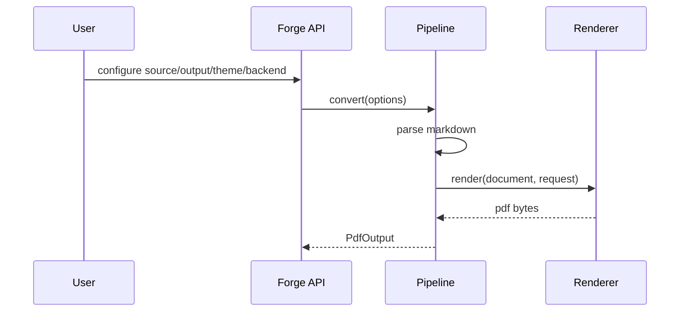
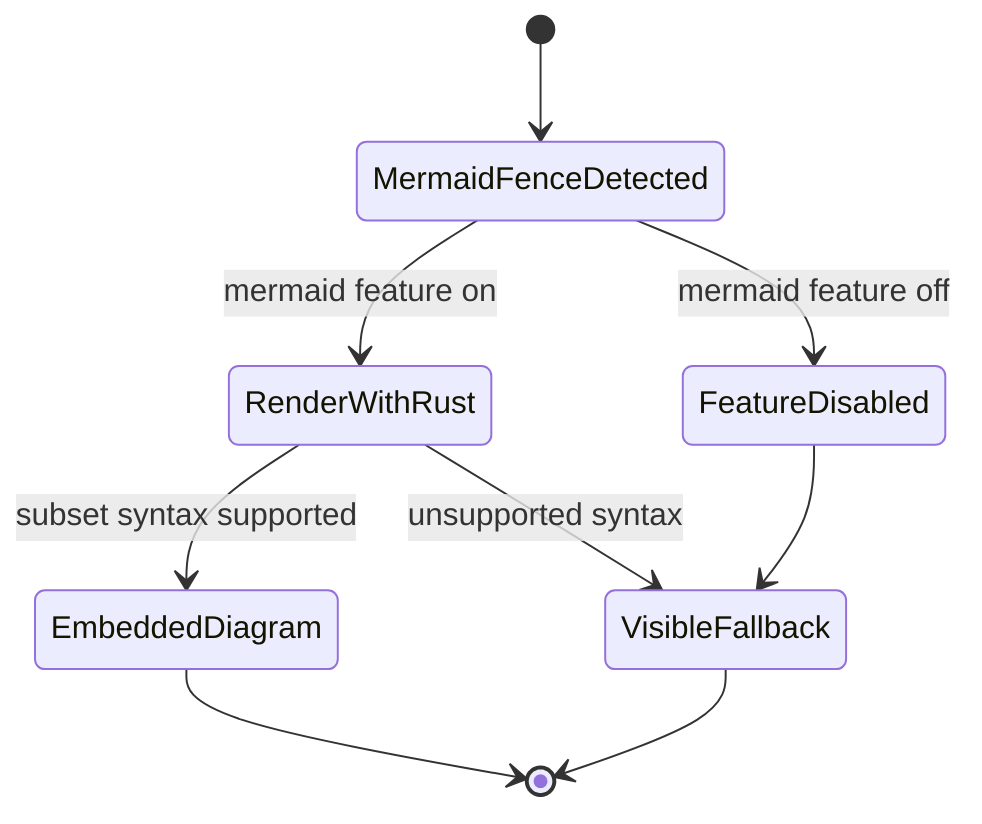
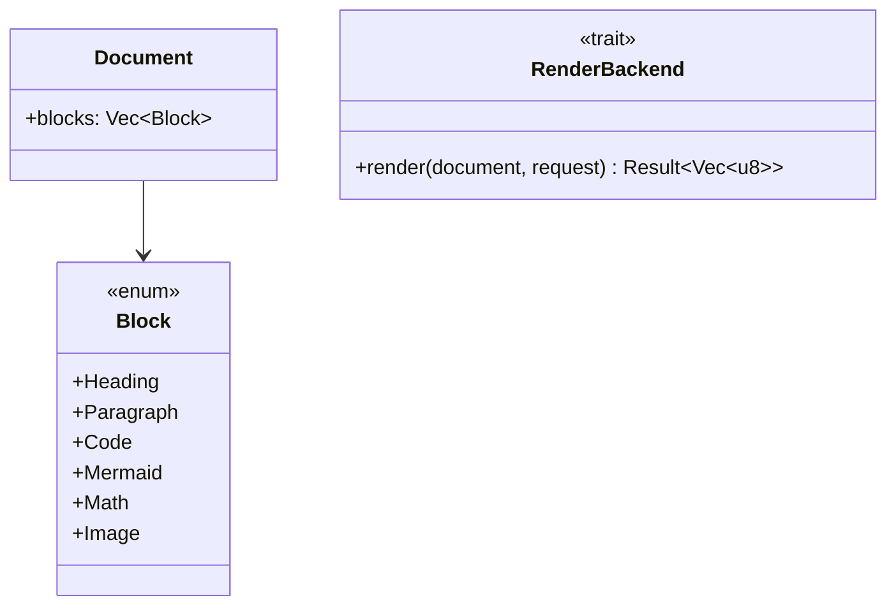
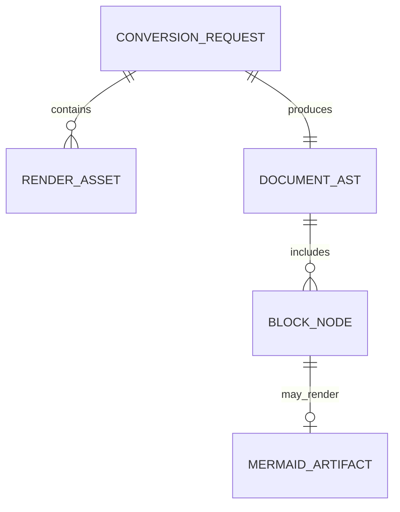
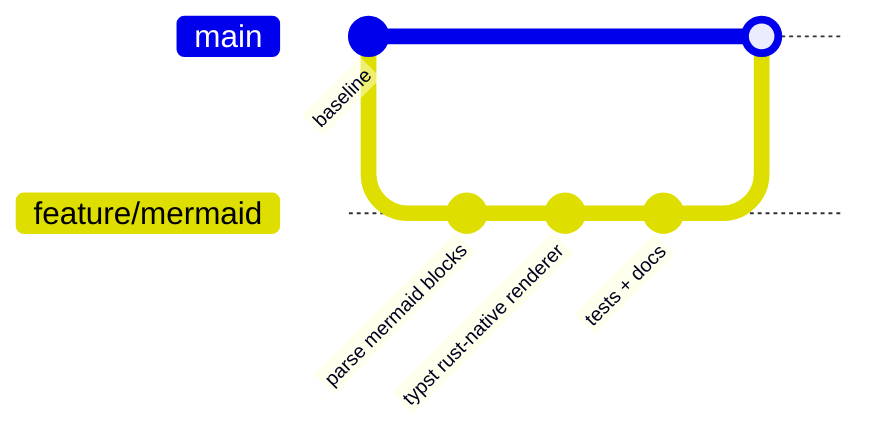
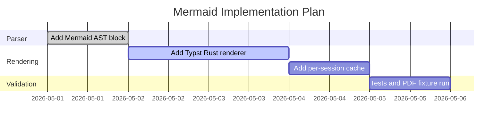

# Engineering a Reliable Markdown-to-PDF Pipeline with Mermaid Diagrams

## Abstract

This article describes how a Rust crate can convert Markdown into production-ready PDFs while preserving clear architecture boundaries, explicit fallback behavior, and deterministic output. We use Mermaid diagrams to document the internal flow and implementation strategy.

## 1. Pipeline Overview

The pipeline is intentionally segmented (`api -> pipeline -> core -> adapters`) so each layer can evolve independently.

## 2. Conversion Sequence

The API layer remains stable while renderer internals can be swapped between Minimal and Typst.

## 3. Mermaid Handling State Model

This model avoids silent data loss and keeps fallback output explicit.

## 4. Core Type Relationships

By elevating Mermaid to a dedicated block variant, downstream renderers can make feature-aware decisions cleanly.

## 5. Data Perspective for Artifacts

The artifact relation helps reason about caching and lifecycle of rendered diagram assets.

## 6. Release Flow for Diagram Support

This workflow keeps implementation changes reviewable and test-backed.

## 7. Delivery Plan Snapshot

## 8. Conclusion

A robust Markdown-to-PDF library should optimize for correctness first: explicit AST nodes, isolated rendering adapters, feature-gated behavior, and transparent fallback paths. With this approach, Mermaid support can be both practical and maintainable in real software delivery.
