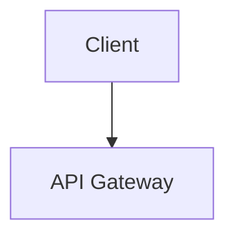

## Mermaid support reference

Mermaid diagrams are written in standard fenced code blocks in Markdown:

```markdown

```

### Common diagram kinds

- `flowchart`
- `sequenceDiagram`
- `stateDiagram`
- `classDiagram`
- `gantt`
- `gitGraph`
- `erDiagram`

## Integration guidance for GlyphWeaveForge

Typst does not natively parse Mermaid syntax. In this project, Mermaid handling is
implemented in Rust and exposed behind the `mermaid` feature. This keeps behavior
explicit and honest:

- Supported subset syntax is rendered into diagram output on the Typst path.
- Unsupported syntax remains visible through fallback markers.
- When the feature is disabled, Mermaid fences are preserved as explicit fallback.

This approach avoids hidden data loss while keeping the `api -> pipeline -> core -> adapters`
boundary clean.
